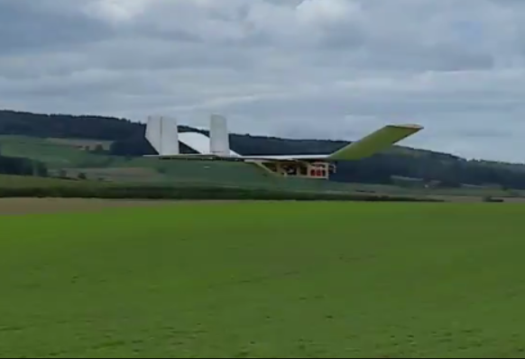
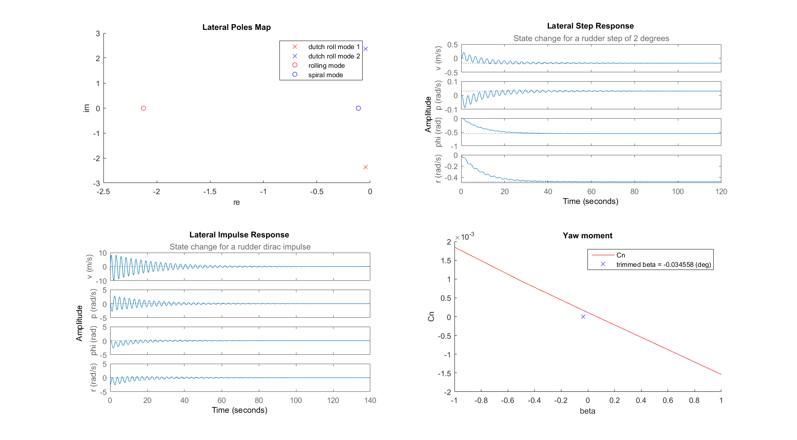
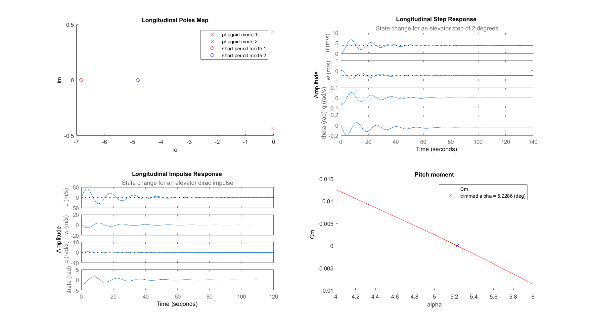
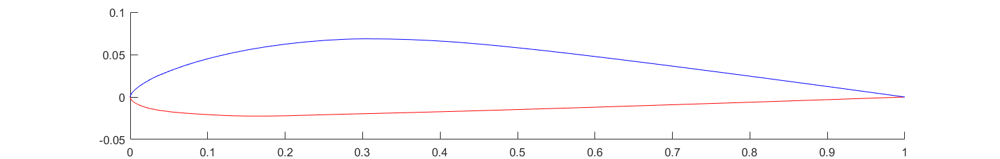
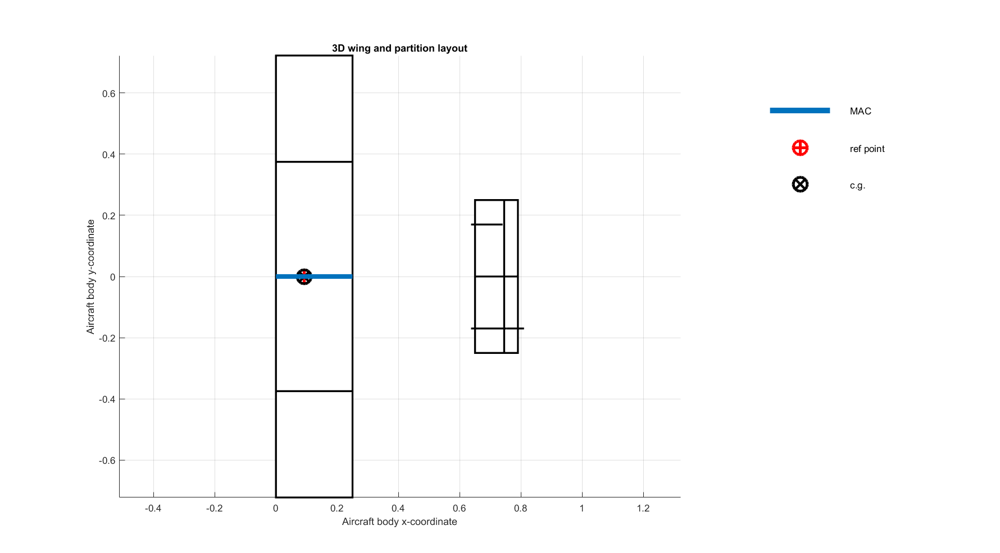

# Simulation of a Fixed-Wing Unmanned Aerial Glider

An example of a non-linear flight dynamics simulation for a unmanned aerial glider with a wingspan of 1.5m. The simulation is implemented with Matlab Simulink and uses FlightGear [[1]](#flightgear) for visualization purposes. 

In addition to existing Simulink examples from the Mathworks documentation, this implementation shows how to:

1. Compute required aerodynamic coefficient tables using Tornado [[2]](#tornado), an implementation of the [vortex lattice method](https://en.wikipedia.org/wiki/Vortex_lattice_method). 
2. Find the trimmed gliding state and deduce longitudinal and lateral linear time invariant systems ([LTI](https://en.wikipedia.org/wiki/Linear_time-invariant_theory)) for the trimmed state according to text book definitions such as the one given in [[3]](#caughey).

Simulation | Real Flight
----------| ------------
 | 
Visualization of the Simulink simulation with FlightGear | Test flight with real airframe
 | 
Characteristics of the corresponding lateral LTI system | Characteristics of the corresponding longitudinal LTI system

## Airframe

The airframe has a twin-boom fuselage and a wing with upward cranked tips. The total wing span is 1.5m and the take-off weight is 1.56kg (actual glider equiped with on-board computer and temporarily installed electric motor for testing / take-off). Center of gravity has been found to be at 92mm from the leading edge of the main wing. Via GPS measurements a gliding velocity of about 45km/h was confirmed (at roughly zero elevator deflection). The glider uses two actuators: elevator and rudder. The rudder is asymmetrically attached to the left of the two vertical stabilizers.

Below is the airframe as defined for the vortex lattice method computation with Tornado:

------------ | ---------------------
 | 

## Applications

### Comp
### Non-Linear Flight Simulation

### Longitudinal and Lateral LTI of Trimmed Gliding State

## Results

Need some plots of Tornado on pressure distribution.

## Installation and Configuration

* Adjust the paths to your FlightGear installation in `runFlightGear.bat` and `runFlightGear.m` in `ExperimentalCarrierSimulink/utilities`.
* To run `mainComputeLTI.m`, check the configuration section to make the necessary adjustments to run this script in your environment and with the desired parameters.

## Running the Simulation

1. Open in Matlab the Simulink project ExperimentalCarrierSimulink.prj. This opens:
  * Plant model
  * ExperimentalCarrier model
  * ExperimentalCarrier_longitudinal model
  * ExperimentalCarrier_lateral model
  * FlightGear

# References

[1]  [FlightGear](http://www.flightgear.org/).  
[2]  Melin, Tomas. [Tornado](http://tornado.redhammer.se/).  
[3]  Caughey, David A. [Introduction to Aircraft Stability and Control](https://courses.cit.cornell.edu/mae5070/Caughey_2011_04.pdf).  
