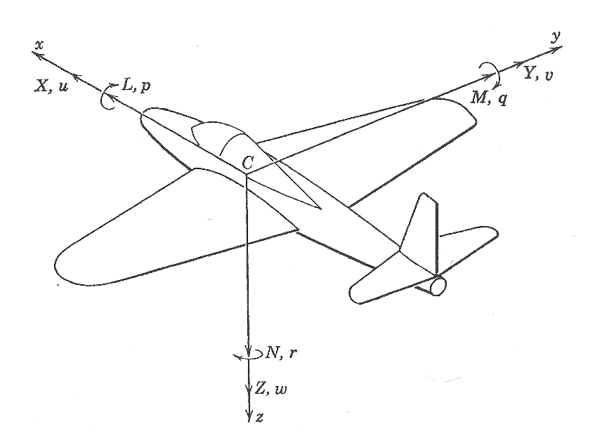
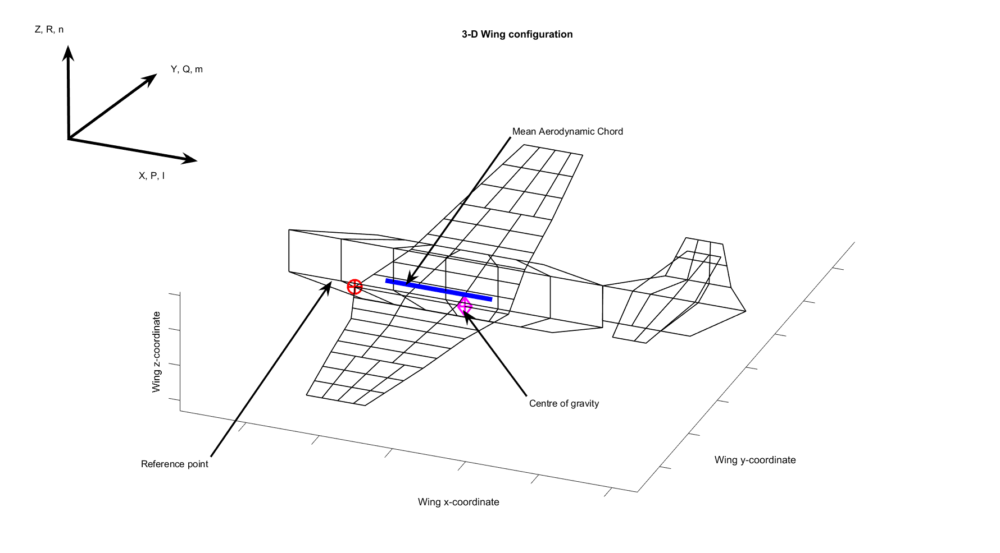
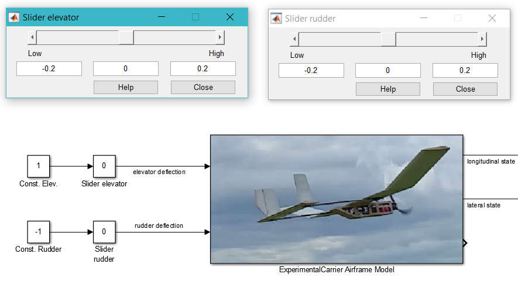

# Simulation of a Fixed-Wing Unmanned Aerial Glider

## Table of Content

[Overview](#overview)  
[Installation](#installation)  
[Airframe](#airframe)  
[Reference Frames](#referenceframes)  
[How to Run the Code](#applications)  
[Results](#results)  
[References](#references)  

## <a name="overview"></a> Overview

An example of a non-linear flight simulation for a unmanned aerial glider with a wingspan of 1.5m. The simulation is implemented with Matlab Simulink and uses [FlightGear](http://www.flightgear.org) for visualization purposes. 

In addition to existing Simulink examples from the Mathworks documentation, this implementation shows how to:

1. [Compute the required aerodynamic coefficient tables](./ExperimentalCarrierSimulink/code/mainComputeCoefficients.m) using [Tornado](http://tornado.redhammer.se/) an implementation of the [vortex lattice method](https://en.wikipedia.org/wiki/Vortex_lattice_method) (VLM). For more information on the Tornado implementation, see also [[1]](#tornado). 
2. [Find the trimmed gliding state and deduce longitudinal and lateral linear time invariant systems](./ExperimentalCarrierSimulink/code/mainComputeLTIs.m) ([LTI](https://en.wikipedia.org/wiki/Linear_time-invariant_theory)) for the trimmed state according to text book definitions such as the one described in [[2]](#caughey).

Simulation | Real Flight
----------| ------------
 | 
Visualization of the Simulink simulation with FlightGear | Test flight with the real airframe

Lateral LTI | Longitudinal LTI
-----------|-------------
 | 
Characteristics of the corresponding lateral LTI system | Characteristics of the corresponding longitudinal LTI system

## <a name="installation"></a>Installation and Configuration

Besides Matlab and Simulink, you need to install [FlightGear](http://www.flightgear.org/) and [Tornado](http://tornado.redhammer.se/).

### FlightGear Installation

After installing FlightGear, it is necessary to copy the aircraft visualization data from your Git working copy to the FlightGear data directory. Assuming you installed FlightGear 3.4.0 on Windows, just copy the content of the working copy folder `FlightGear\Aircraft\ExperimentalCarrier` to `C:\Program Files\FlightGear 3.4.0\data\Aircraft\ExperimentalCarrier`. For other versions or operating systems, proceed accordingly.

Edit the files `runFlightGear.bat` and `runFlightGear.m` in `ExperimentalCarrierSimulink/utilities` and adjust the FlightGear installation path to point to the correct location.

### Tornado Installation

Download Tornado [here](http://tornado.redhammer.se/index.php/download) and unzip it anywhere convenient, for example to `C:\tornado\T135_export`.

#### Install the Airframe and Airfoil Definitions

To install the airframe definition, copy [ExperimentalCarrier.mat](./Tornado/aircraft/ExperimentalCarrier.mat) to `T135_export/aircraft`. To install the airfoil, copy also [JR001.dat](./Tornado/aircraft/airfoil/JR001.dat) to `T135_export/aircraft/airfoil`.

#### Get Rid of Interp1 Warnings in Tornado

Edit `T135_export\fLattice_setup2.m` and replace in calls to `interp1` (4 locations) `cubic` with `pchip`. This will fix the Matlab warning
```
Warning: INTERP1(...,'CUBIC') will change in a future release. Use INTERP1(...,'PCHIP') instead. 
```
#### Configure the Tornado Installation Directory

Assuming you have installed Tornado under `C:\tornado\T135_export`. Edit [`mainComputeCoefficients.m`](./ExperimentalCarrierSimulink/code/mainComputeCoefficients.m) and [`mainComputeLTIs.m`](./ExperimentalCarrierSimulink/code/mainComputeLTIs.m) in `ExperimentalCarrierSimulink/code` and adjust the `tornado_root_directory` variable definition to point to the Tornado root directory, e.g.:
```
tornado_root_directory = 'C:\tornado\T135_export';
```
You can now run the simulation. Jump [here](#applications) to see how, or continue reading to learn about the airframe and the relevant reference frames first.

## <a name="airframe"></a>Airframe

The simulated airframe has a twin-boom fuselage and a wing with upward cranked tips. The total wing span is 1.5m and the take-off weight is 1.56kg (actual glider equiped with on-board computer and temporarily installed electric motor for testing / take-off). Center of gravity has been found to be at 92mm from the leading edge of the main wing. Via GPS measurements a gliding velocity of about 45km/h was confirmed (at roughly zero elevator deflection). The glider uses two actuators: elevator and rudder. The rudder is asymmetrically attached to the left of the two vertical stabilizers.

Below is the airframe as defined for the vortex lattice method computation with Tornado:

Wing partition layout | VLM discretization
---------|----------
  | 

Airfoil JR001 | Example pressure distribution computed by Tornado 
--------------|---------------------
 | 

The airfoil JR001 features a planar pressure side which simplifies the build procedure for the wing. The profile was designed to work well with low Reynold's numbers and to provide friendly stall characteristics. It wasn't designed with gliding performance in mind.

Further drawings related to the airframe can be found [here](./Tornado/aircraft/ExperimentalCarrier.svg) and [here](./figures/StabilityAxisReferenceForTrimmedGliding.svg). The Tornado definition of the airframe is [here](./Tornado/aircraft).

## <a name="referenceframes"></a>Reference Frames

When specifying forces, moments, or angles a body-fixed reference frame is used. The usual convention is shown in the figure below on the left. This is the convention as introduced in [[2]](#caughey) and also as used in Matlab. The Tornado implementation [[1]](#tornado) uses a slightly different reference frame, see below on the right.
 
Standard Body-fixed Reference Frame | Tornado Body-fixed Reference Frame
---------|----------
 | 
Standard notation for forces and moments, and linear and rotational velocities in a body-fixed reference frame. The origin is located at the center of gravity (figure reproduced from [[2]](#caughey)) | Reference frame as used in the Tornado VLM implementation. The origin is located at the leading edge of the wing and the x-axis extends aft (figure reproduced from [[1]](#tornado)).

### Stability Axes

Another reference frame which is sometimes used is a set of axes for which the x-axis is parallel to the velocity vector for an equilibrium state (e.g. trimmed gliding). Such axes are called _stability axes_. Choosing the principal axes in this way simplifies some equations when computing longitudinal and lateral linear systems from given aerodynamic coefficients (see also [[2]](#caughey) pp. 45). But since the solution implemented here, finds the corresponding LTI systems by linearizing a non-linear model around an equilibrium state, this is not really an advantage.

The stability axes reference frame is not used in this implementation.

## <a name="applications"></a>How to Run the Code

The codebase and the Simulink models can be used to:

1. Compute aerodynamic properties and [coefficients](#coefficients) using the Tornado VLM implementation.
2. Run the [non-linear flight simulation](#simulation) using previously computed coefficient matrices.
3. Extract the [linear time-invariant systems](#lti) for the trimmed gliding state.

### <a name="coefficients"></a>Compute the Aerodynamic Coefficients

Aerodynamic coefficient matrices are computed by calling the [script](./ExperimentalCarrierSimulink/code/mainComputeCoefficients.m):
```
mainComputeCoefficients.m
```
Results are visualized [here](#coefficient_results).

Input for the calculation is:

1. Tornado airframe definition (geometry and airfoil),
2. center of gravity position
1. air speed [m/s]
2. air density [kg/m^3]
3. range of ``alpha`` and ``beta`` values for which coefficients shall be computed (``alpha`` denotes the angle of attack, and ``beta`` the sideslip angle). 

Output is for each coefficient a 2-dimensional matrix which contains the coefficient's value for all specified ``[alpha, beta]`` configurations. Computed coefficient matrices can be found [here](./ExperimentalCarrierSimulink/output). The coefficient naming convention is summarized below.

#### Aerodynamic Coefficients

##### Datum Coefficients

* ``CX``: force coefficient in body-fixed longitudinal direction.
* ``CY``: force coefficient in body-fixed lateral direction.
* ``CZ``: force coefficient perpendicular to ``CX``, ``CY`` (body-fixed 'lift').
* ``Cl``: roll moment coefficient.
* ``Cm``: pitch moment coefficient.
* ``Cn``: yaw moment coefficient.

##### Damping Coefficients

For each force and moment coefficient, a damping coefficient is computed. These coefficients specify how each coefficient changes when the aircraft rolls (``P``), pitches (``Q``), or yaws (``R``). The resulting matrices are ``CX_P``, ``CX_Q``, ``CX_R``, ``CY_P``, ``CY_Q``, ``CY_R``, ``CZ_P``, ``CZ_Q``, ``CZ_R``, ``Cl_P``, ``Cl_Q``, ``Cl_R``, ``Cm_P``, ``Cm_Q``, ``Cm_R``, ``Cn_P``, ``Cn_Q``, ``Cn_R``.   

##### Control Surface Deflection Coefficients

For each control surface, coefficient derivatives ``*_d`` are computed. They denote how much the respective coefficient changes when the respective surface is deflected. The resulting matrices ``CX_d``, ``CY_d``, ``CZ_d``, ``Cl_d``, ``Cm_d``, ``Cn_d`` are 3-dimensional where the index of the third dimension denotes the control surface.

#### Other Aerodynamic Properties

Tornado can also be used to estimate the _neutral point_ of the entire airframe. The neutral point is the point on the vehicle's x-axis where the aerodynamic moment ``Cm`` remains constant independently of the angle of attack. The distance between the center of gravity and the neutral point is called the _stability margin_. In a classic fixed-wing configuration, the center of gravity has to be placed before the neutral point (in flight direction). If the the stability margin approaches zero, the airplane becomes unstable. For the considered airframe, Tornado calculated the neutral point to lie at 49% MAC (mean aerodynamic chord), which is for the given wing geometry simply ``0.49*0.25``[m].

### <a name="simulation"></a>Run the Non-Linear Flight Simulation

Open the ``ExperimentalCarrierSimulink.prj`` located [here](./ExperimentalCarrierSimulink). This will start FlightGear and open a couple of Simulink models. Select and run the ``Plant`` model. Switch to the FlightGear window and use ``v`` to change the view perspective.

#### Control the glider

To control the glider the elevator and rudder surface deflection can be adjusted with two sliders as shown below.

 

### <a name="lti"></a>Compute Lateral and Longitudinal Linear Systems for the Trimmed Gliding State

To find the trimmed gliding state and calculate the lateral and longitudinal linear systems, run the [script](./ExperimentalCarrierSimulink/code/mainComputeLTIs.m):
```
mainComputeLTIs.m
```
Results are shown [here](#lti_results).

The resulting linear systems correspond to the ones derived in [[2]](#caughey) (see Sect. 5.2 and Sect. 5.3), except that they are calculated for the coordinate system of the standard body-fixed reference frame and not in the reference frame of the equilibrium axes.

## <a name="results"></a>Results

### <a name="coefficient_results"></a>Aerodynamic Coefficients

 

Datum coefficients (forces and moments).


Elevator control surface derivatives. Describe how datum coefficients change when the elevator is deflected.


Rudder control surface derivatives. Describe how datum coefficients change when the rudder is deflected.

Asymmetric values appear due to the asymmetry of the vertical stabilizers (only the stabilizer on the port side carries the rudder control surface).

For remaining coefficients, see [here](./results/mainComputeCoefficients).

### <a name="lti_results"></a>Lateral and Longitudinal Linear Systems

Output of `mainComputeLTIs.m`:
```
alpha 5.2286 deg, beta 1 deg
 
Searching for trimmed operating point of lateral dynamics...
Number of iterations: 3
Operating point specifications were successfully met.
 
Trimmed lateral state: 
============================
1) v     : velocity in y-body           (m/s): -0.0069615
2) p     : rotation velocity x-body   (deg/s): 0.0014094
3) phi   : euler roll angle             (deg): -1.5419
4) r     : rotation velocity z-body    deg/s): -0.022565
 
Other parameters in trimmed lateral state: 
================================================
Beta     : sideslip                        (deg): -0.034558
Absolute velocity (longitudinal & lateral) (m/s): 11.5901
 
Short Period Mode Properties (longitudinal): 
                                                 Pole 1      Pole 2
==============================================================================
Damping ratio                                 : 1  1
Undampted, natural frequency             (1/s): 6.8464      4.8203
Period                                     (s): Inf  Inf
Num. cycles to damp to half the amplitude     : 0  0
 
Phugoid Mode Properties (longitudinal): 
                                                 Pole 1      Pole 2
==============================================================================
Damping ratio                                 : 0.10757     0.10757
Undampted, natural frequency             (1/s): 0.43627     0.43627
Period                                     (s): 14.4863      14.4863
Num. cycles to damp to half the amplitude     : 1.0196      1.0196
 
Roll Mode Properties (lateral): 
                                                 Pole 1
==============================================================================
Damping ratio                                 : 1
Undampted, natural frequency             (1/s): 2.1251
Period                                     (s): Inf
Num. cycles to damp to half the amplitude     : 0
 
Spiral Mode Properties (lateral): 
                                                 Pole 1
==============================================================================
Damping ratio                                 : 1
Undampted, natural frequency             (1/s): 0.1132
Period                                     (s): Inf
Num. cycles to damp to half the amplitude     : 0
 
Dutch Roll Mode Properties (lateral): 
                                                 Pole 1      Pole 2
==============================================================================
Damping ratio                                 : 0.018588    0.018588
Undampted, natural frequency             (1/s): 2.3622      2.3622
Period                                     (s): 2.6603      2.6603
Num. cycles to damp to half the amplitude     : 5.9339      5.9339
 
Number of unobservable states (longitudinal)  : 0
Number of unobservable states (lateral)       : 0
 
Number of uncontrollable states (longitudinal): 0
Number of uncontrollable states (lateral)     : 0

```

Longitudinal system:
```
ltiLongitudinal =
 
  a = 

         0.004876         1.101        -1.056        -9.759
           -1.009        -7.448         2.742       -0.6098
           0.0347       -0.3791        -4.318             0
                0             0             1             0
 
  b = 
                
                0
            10.21
           -9.064
                0
```

Lateral system:
```
ltiLateral =
 
  a = 

          -0.7838        0.6121         9.755        -11.15
          -0.7469        -1.227             0        0.1967
                0             1    -3.794e-05       0.06246
           0.3551      -0.02095             0       -0.3154
 
  b = 

           -2.526
                0
                0
           -2.519
```


Short period and phugoid modes (poles) of the longitudinal system. Dirac and step response to elevator deflection. A negative pitch moment curve for increasing alpha values (angle of attack) confirms the glider's positive stability margin.

 

Spiral, rolling, and dutch role modes (poles) of the lateral system. Dirac and step response to rudder deflection. 

# <a name="references"></a>References
  
[1] <a name="melin"></a> Melin, Tomas. [Tornado, a vortex lattice MATLAB implementation for Linear Aerodynamic Wing applications](https://www.researchgate.net/profile/Tomas_Melin/publication/238671899_A_Vortex_Lattice_MATLAB_Implementation_for_Linear_Aerodynamic_Wing_Applications/links/0deec5302051604432000000.pdf), Masters thesis, Royal Institute of Technology (KTH), Sweden, December 2000.  
[2] <a name="caughey"></a> Caughey, David A. [Introduction to Aircraft Stability and Control](https://courses.cit.cornell.edu/mae5070/Caughey_2011_04.pdf), Course Notes for Mechanical & Aerospace Engineering, Cornell University, New York, USA, 2011.

