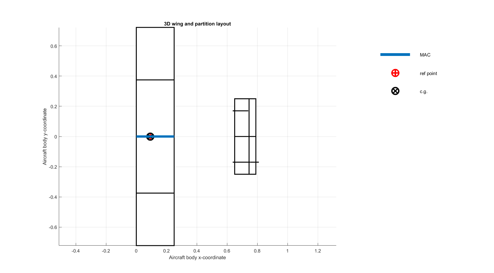
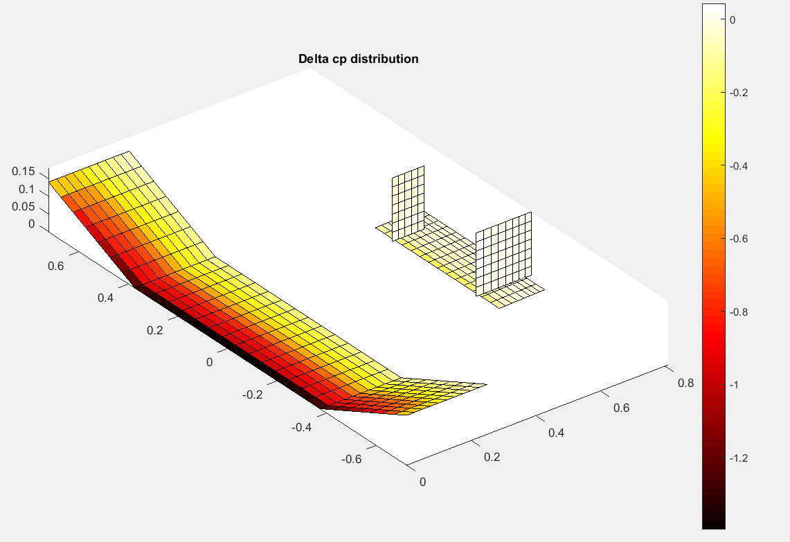
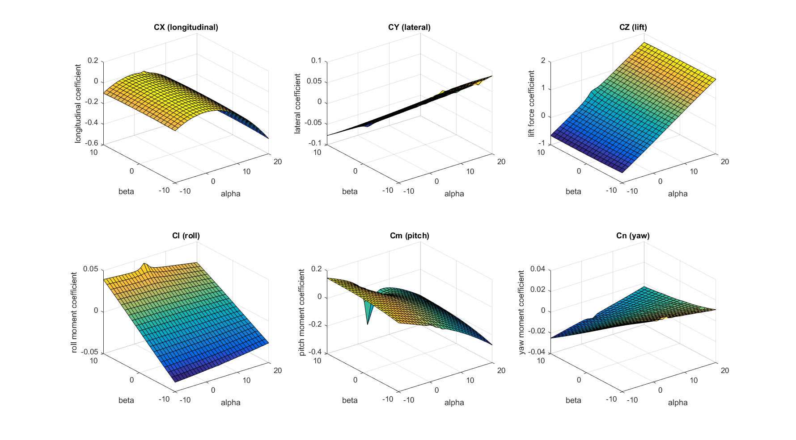
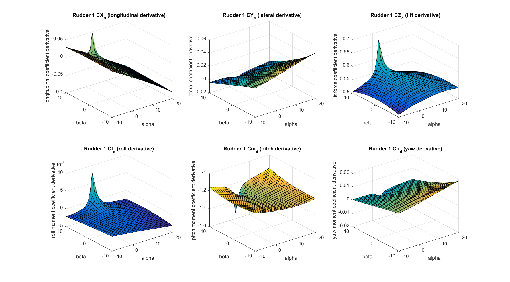
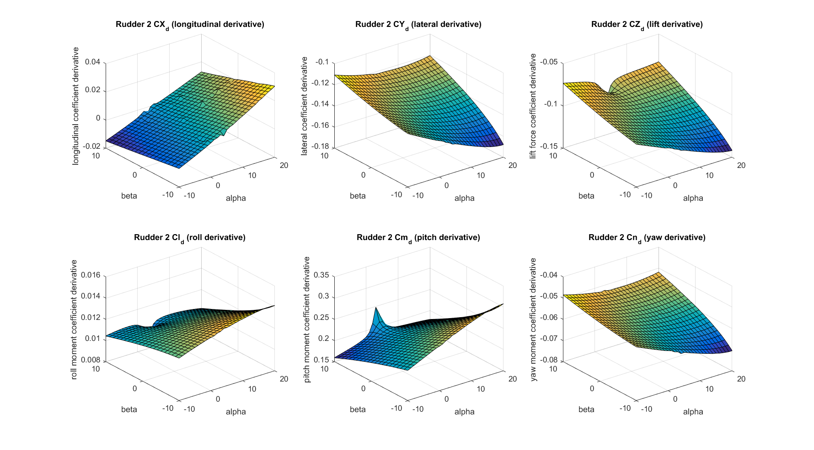

# Simulation of a Fixed-Wing Unmanned Aerial Glider

An example of a non-linear flight simulation for a unmanned aerial glider with a wingspan of 1.5m. The simulation is implemented with Matlab Simulink and uses [FlightGear](http://www.flightgear.org) for visualization purposes. 

In addition to existing Simulink examples from the Mathworks documentation, this implementation shows how to:

1. Compute the required aerodynamic coefficient tables using [Tornado](http://tornado.redhammer.se/) an implementation of the [vortex lattice method](https://en.wikipedia.org/wiki/Vortex_lattice_method) (VLM). For more information on the Tornado implementation, see also [[1]](#tornado). 
2. Find the trimmed gliding state and deduce longitudinal and lateral linear time invariant systems ([LTI](https://en.wikipedia.org/wiki/Linear_time-invariant_theory)) for the trimmed state according to text book definitions such as the one described in [[2]](#caughey).

Simulation | Real Flight
----------| ------------
 | 
Visualization of the Simulink simulation with FlightGear | Test flight with the real airframe

Lateral LTI | Longitudinal LTI
-----------|-------------
 | 
Characteristics of the corresponding lateral LTI system | Characteristics of the corresponding longitudinal LTI system

## Installation and Configuration

TODO

* Adjust the paths to your FlightGear installation in `runFlightGear.bat` and `runFlightGear.m` in `ExperimentalCarrierSimulink/utilities`.
* To run `mainComputeLTI.m`, check the configuration section to make the necessary adjustments to run this script in your environment and with the desired parameters.

## Simulated Airframe

The airframe has a twin-boom fuselage and a wing with upward cranked tips. The total wing span is 1.5m and the take-off weight is 1.56kg (actual glider equiped with on-board computer and temporarily installed electric motor for testing / take-off). Center of gravity has been found to be at 92mm from the leading edge of the main wing. Via GPS measurements a gliding velocity of about 45km/h was confirmed (at roughly zero elevator deflection). The glider uses two actuators: elevator and rudder. The rudder is asymmetrically attached to the left of the two vertical stabilizers.

Below is the airframe as defined for the vortex lattice method computation with Tornado:

Wing partition layout | VLM discretization
---------|----------
  | 

Airfoil JR001 | Example pressure distribution computed by Tornado 
--------------|---------------------
 | 

The airfoil JR001 features a planar pressure side which simplifies the build procedure and provides. The profile was designed to work well with low Reynold's numbers and to provide friendly stall characteristics. It wasn't designed with gliding performance in mind.

Further drawings related to the airframe can be found [here](./Tornado/aircraft/ExperimentalCarrier.svg) and [here](./figures/StabilityAxisReferenceForTrimmedGliding.svg). The Tornado definition of the airframe is [here](./Tornado/aircraft).

## Reference Frames

TODO

## Applications

The codebase and the provided Simulink models can be used to:

1. Compute aerodynamic properties and [coefficients](#coefficients) using the Tornado VLM implementation.
2. Run a [non-linear flight simulation[(#simulation) using previously computed coefficient matrices.
3. Extract the [linear time-invariant systems](#lti) for the trimmed gliding state.

### <a name="coefficients"></a>Compute the Aerodynamic Coefficients

Aerodynamic coefficient matrices are computed by calling:
```
mainComputeCoefficients.m
```
Results are visualized [here](#results).

Input for the calculation is

1. Tornado airframe definition (geometry and airfoil),
2. center of gravity position
1. air speed [m/s]
2. air density [kg/m^3]
3. range of ``alpha`` and ``beta`` values for which coefficients shall be computed (``alpha`` denotes the angle of attack, and ``beta`` the sideslip angle). 

The computation outputs for each coefficient a 2-dimensional matrix which contains the coefficients value for all specified ``[alpha, beta]`` configurations. Already computed coefficient matrices can be found [here](./ExperimentalCarrierSimulink/output). The coefficient naming convention is summarized below.

#### Aerodynamic Coefficients

##### Datum Coefficients

* ``CX``: force coefficient in body-fixed longitudinal direction.
* ``CY``: force coefficient in body-fixed lateral direction.
* ``CZ``: force coefficient perpendicular to ``CX``, ``CY`` (body-fixed 'lift').
* ``Cl``: roll moment coefficient.
* ``Cm``: pitch moment coefficient.
* ``Cn``: yaw moment coefficient.

##### Damping Coefficients

For each force and moment coefficient, a damping coefficient is computed. These coefficients specify how each coefficient changes when the aircraft rolls (``P``), pitches (``Q``), or yaws (``R``). The resulting matrices are ``CX_P``, ``CX_Q``, ``CX_R``, ``CY_P``, ``CY_Q``, ``CY_R``, ``CZ_P``, ``CZ_Q``, ``CZ_R``, ``Cl_P``, ``Cl_Q``, ``Cl_R``, ``Cm_P``, ``Cm_Q``, ``Cm_R``, ``Cn_P``, ``Cn_Q``, ``Cn_R``.   

##### Control Surface Deflection Coefficients

For each control surface, coefficient derivatives ``*_d`` are computed. They denote how much the respective coefficient changes when the respective surface is deflected. The resulting matrices ``CX_d``, ``CY_d``, ``CZ_d``, ``Cl_d``, ``Cm_d``, ``Cn_d`` are 3-dimensional where the index of the third dimension denotes the control surface.

#### Other Aerodynamic Properties

Tornado can also be used to estimate the _neutral point_ of the entire airframe. The neutral point is the point on the vehicles x-axis where the aerodynamic moment ``Cm`` remains constant independently of the angle of attack. The distance between the center of gravity and the neutral point is called the _stability margin_. In a classic fixed-wing configuration, the center of gravity has to be placed before the neutral point (in flight direction). If the the stability margin approaches zero, the airplane becomes unstable. For the considered airframe, Tornado calculated the neutral point to lie at 49% MAC (mean aerodynamic chord), which is for the given wing geometry simply ``0.49*0.25``[m].

### <a name="simulation"></a>Run the Non-Linear Flight Simulation

Open the ``ExperimentalCarrierSimulink.prj`` located [here](./ExperimentalCarrierSimulink). This will start FlightGear and open a couple of Simulink models. Select and run the ``Plant`` model. Switch to the FlightGear window and use ``v`` to change the view perspective.

#### Control the glider

TODO

### <a name="lti"></a>Compute Longitudinal and Lateral Linear Systems for the Trimmed Gliding State

TODO

## <a name="results"></a>Results

### Aerodynamic Coefficients

 

Datum coefficients (forces and moments).



Elevator control surface derivatives. Describe how datum coefficients change when the elevator is deflected.



Rudder control surface derivatives. Describe how datum coefficients change when the rudder is deflected.

Asymmetric values appear due to the asymmetry of the vertical stabilizers (only the stabilizer on the port side carries the rudder control surface).

For remaining coefficients, see [here](./results/mainComputeCoefficients).


# References
  
[1] <a name="melin"></a> Melin, Tomas. [Tornado, a vortex lattice MATLAB implementation for Linear Aerodynamic Wing applications](https://www.researchgate.net/profile/Tomas_Melin/publication/238671899_A_Vortex_Lattice_MATLAB_Implementation_for_Linear_Aerodynamic_Wing_Applications/links/0deec5302051604432000000.pdf), Masters thesis, Royal Institute of Technology (KTH),Sweden, December 2000.  
[2] <a name="caughey"></a> Caughey, David A. [Introduction to Aircraft Stability and Control](https://courses.cit.cornell.edu/mae5070/Caughey_2011_04.pdf).  
